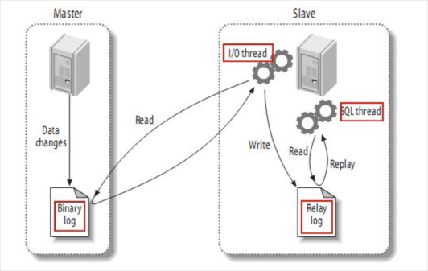
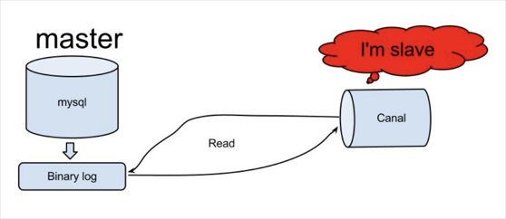
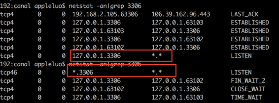
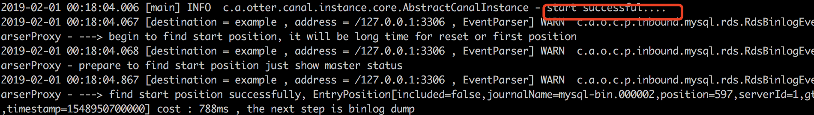
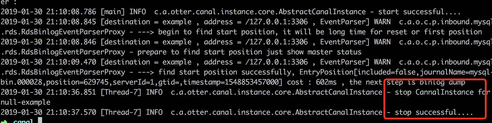
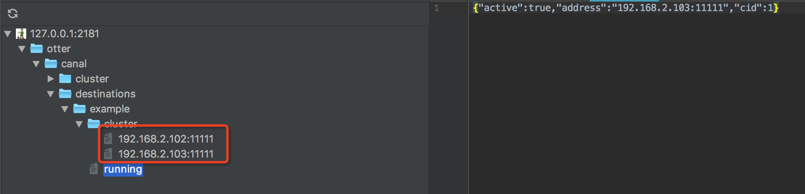
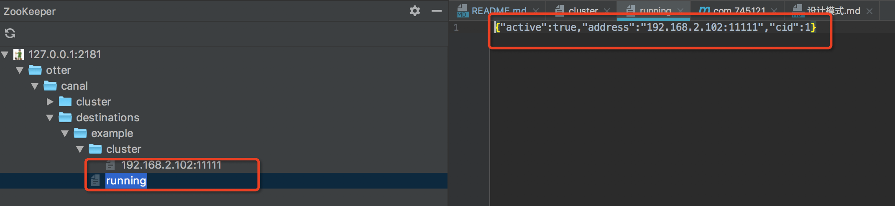
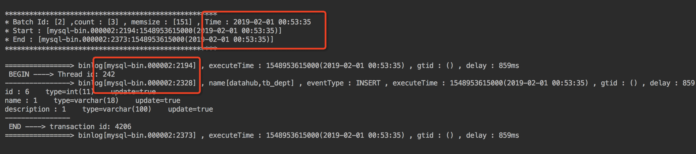
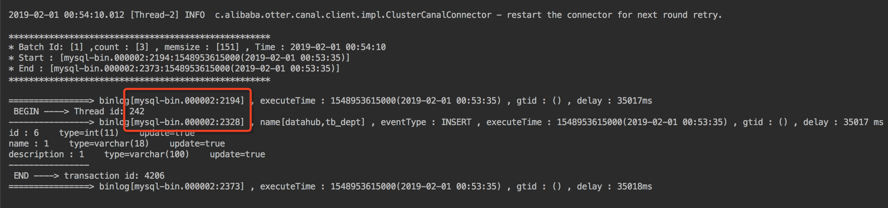

| Ⅰ | Ⅱ | Ⅲ | Ⅳ | Ⅴ |Ⅵ |Ⅶ|Ⅷ|Ⅸ|Ⅹ|Ⅺ|
| :--------: | :--------: | :--------: | :--------: |:--------: |:--------: |:--------: |:--------: |:--------: |:--------: |:--------: |
|算法:scissors:| 语言:books:| 数据库:floppy_disk:| 中间件:wrench:| 设计:pencil2:| 项目:office:| 想法:stars:| 大数据:1234:| 代码解析:100:| 工作记录:scroll:| 杂记:smoking: |
## :scissors: 算法
## :books: 语言
### java语法
#### 第某章：java泛型
### kotlin基础语法
#### 第某章：kotlin泛型
##### 什么是泛型？
广泛的类型就是泛型,粗暴点讲List<T>中的T，和普通的类型差别就是这个T。List<T>表示的含义是List队列中不存储具体的类型而是存储广泛的类型，比如List<String>表示可以操作String数组，List<Long>表示可以操作Long数组。
##### 为什么使用泛型？
有的类可以处理一系列对象，比如List类的作用是以操作一些对象列表，如果定义StringList，LongList，这两个类除了操作的对象之外，其他的操作都是一样的，这种情况下使用泛型可以减少冗余代码，在代码中冗余代码就是坏味道的开始。
##### 什么时候使用？
一个类可以操作或者产生一些不同的类的时候可以使用泛型
##### 怎么使用kotlin泛型？
泛型的作用和概念，在java中和kotlin中都是相似的，但是使用方法略有区别，可以java泛型那章对比着看。
###### 名次解释
类型形参:List<T>中的T就是类型形参
类型形参声明:`fun <T> List<T> `第一个T是声明
类型实参:List<String>中的String就是类型形参
###### 声明一个kotlin泛型
泛型可以被使用在类上,函数上，属性上。
###### 泛型函数和属性
泛型用在扩展函数上
`fun <T> List<T>.slice(indics:IntRange):List<T> `第一个是声明，第二个和第三个是形参。
```kotlin
  val letters = ('a'..'z').toList()
  println(letters.slice<Char>(0..2))//类似于 public static <T> slice（List<T> list,IntRange indics）
```
letters会被kotlin编译器识别是<Char>所以可以省略
  
泛型也可以用在lambda上
```kotlin
  val authors= listOf (”Dmitry”, ”Svetlana")
  val readers = mutableListOf<String> (/* . . */)
  fun <T> List<T>.filter (predicate: (T) - > Boolean) : List<T>
  readers.filter { it !in authors }
```
上面的例子表示接受一个入参类型为<T>的函数
  
泛型用在扩展属性上
```kotlin
  val <T> List<T>.penultimate: T //类似于public static <T> getPenultimate（List<T> list）
      get() = this[size - 2]
```
不能声明泛型非扩展属性
###### 泛型类
和java一样，在类名称后面加一个尖括号，再把类型参数反正括号内来声明泛型类和泛型接口
```kotlin
interface List<T> {
  operator fun Int): T //在接口和类中T可以当作普通类型使用
```
如果继承了一个泛型类或泛型接口，你得为基础类提供一个类型实参或是另外一个类型形参数,如StringList:List<String>或List2<T>:List<T>
### java虚拟机
#### java内存区域与内存溢出异常
#### 垃圾收集器与内存分配策略
#### 虚拟机性能监控与故障处理工具
#### 调优案例分析与实战
#### 类文件结构
#### 虚拟机类加载机制
#### 虚拟机字节码执行引擎
#### 类加载及执行子系统的案例与实战
#### 早期(编译期)优化
#### 晚期(运行期)优化
#### java内存模型与线程
#### 线程安全与锁优化
## :floppy_disk: 数据库
## :wrench: 中间件

### canal从入门到放弃到继续入门
#### 前言
##### 1. canal是什么  
canal的定位是基于数据库增量日志解析，提供增量数据订阅&消费，目前主要支持了mysql   
##### 2. 本节学什么  
canal的作用会在后续的章节进行详细描述，这一节主要讲明白为什么先写canal，会后续的章节的综述。canal的功能强大，代码逻辑在各个中间件中属于比较容易的。   
##### 3. 学习的canal的好处是什么  
通过学习canal的使用和源码，不仅仅能在开发过程中提供另外设计的思路，更能在学习源码的过程中提高自己代码水平，可以说这是码龄3年内程序员最好的选择。  
##### 4. 概述  
后续的内容我主要从三个方向去讲述canal。一是canal的使用，canal有哪些功能，生产环境canal是如何发挥功效的，开发人员又是如何使用的，二是canal大体的工作原理，三是canal的源码解析，包括一些实体类的作用和框架。主要的逻辑就是从宏观到微观。
#### 简单介绍
##### 项目介绍
背景：早期，阿里巴巴B2B公司因为存在杭州和美国双机房部署，存在跨机房同步的业务需求。不过早期的数据库同步业务，主要是基于trigger的方式获取增量变更，不过从2010年开始，阿里系公司开始逐步的尝试基于数据库的日志解析，获取增量变更进行同步，由此衍生出了增量订阅&消费的业务，从此开启了一段新纪元。ps. 目前内部使用的同步，已经支持mysql5.x和oracle部分版本的日志解析  

名称：canal [kə'næl]  

译意： 水道/管道/沟渠  

语言： 纯java开发  

定位： 基于数据库增量日志解析，提供增量数据订阅&消费，目前主要支持了mysql  
##### 工作原理  
  
1.mysql-master将改变记录到二进制日志(binary log)中（这些记录叫做二进制日志事件，binary log events，可以通过show binlog events进行查看）；  
2.mysql-slave将master的binary log events拷贝到它的中继日志(relay log)；  
3.mysql-slave重做中继日志中的事件，将改变反映它自己的数据  
  
原理相对比较简单：  
1.canal模拟mysql slave的交互协议，伪装自己为mysql slave，向mysql master发送dump协议  
2.mysql master收到dump请求，开始推送binary log给slave(也就是canal)  
3.canal解析binary log对象(原始为byte流)  
#### 单机部署  
1.mysql开启binlog
查看是否开启(如果没有返回则表示没有开启，需要修改配置)
```bash
show master status;
```
2.mac环境查看mysql配置路径(/etc/my.cnf /etc/mysql/my.cnf /usr/local/etc/my.cnf ~/.my.cnf)
```bash
~ appleluo$ mysql --help --verbose | grep my.cnf
order of preference, my.cnf, $MYSQL_TCP_PORT,
/etc/my.cnf /etc/mysql/my.cnf /usr/local/etc/my.cnf ~/.my.cnf
```
3.修改配置
```bash
[mysqld]
log-bin=mysql-bin #添加这行
binlog-format=ROW #添加这行,选择row模式
server_id=1 #添加这行,配置mysql replaction需要定义，不能和canal的slaveId重复
```
4.再次查看mysql是否成功开启binlog
```bash
show master status;
```
5.使用git下载canal项目，后续的源码详解会用的到。你可以选择最近的release版本进行打包
```bash
git clone https://github.com/alibaba/canal.git
cd canal; 
mvn clean install -Dmaven.test.skip -Denv=release
```
6.解压tar,$version换成你打包的版本
```bash
mkdir /tmp/canal
tar zxvf target/canal.deployer-$version.tar.gz  -C /tmp/canal
cd /tmp/canal
```
7.修改配置(1.0.26+)
```bash
vim conf/example/instance.properties

#################################################
## mysql serverId , v1.0.26+ will autoGen
# canal.instance.mysql.slaveId=0

# enable gtid use true/false
canal.instance.gtidon=false

# position info
canal.instance.master.address=127.0.0.1:3306
canal.instance.master.journal.name=
canal.instance.master.position=
canal.instance.master.timestamp=
canal.instance.master.gtid=

# rds oss binlog
canal.instance.rds.accesskey=
canal.instance.rds.secretkey=
canal.instance.rds.instanceId=

# table meta tsdb info
canal.instance.tsdb.enable=true
#canal.instance.tsdb.url=jdbc:mysql://127.0.0.1:3306/canal_tsdb
#canal.instance.tsdb.dbUsername=
#canal.instance.tsdb.dbPassword=

#canal.instance.standby.address =
#canal.instance.standby.journal.name =
#canal.instance.standby.position =
#canal.instance.standby.timestamp =
#canal.instance.standby.gtid=

# username/password
canal.instance.dbUsername=root
canal.instance.dbPassword=shihui521
canal.instance.connectionCharset = UTF-8
canal.instance.defaultDatabaseName =datahub
# enable druid Decrypt database password
canal.instance.enableDruid=false
#canal.instance.pwdPublicKey=MFwwDQYJKoZIhvcNAQEBBQADSwAwSAJBALK4BUxdDltRRE5/zXpVEVPUgunvscYFtEip3pmLlhrWpacX7y7GCMo2/JM6LeHmiiNdH1FWgGCpUfircSwlWKUCAwEAAQ==

# table regex
canal.instance.filter.regex=.*\\..*
# table black regex
canal.instance.filter.black.regex=

# mq config
canal.mq.topic=example
# dynamic topic route by schema or table regex
#canal.mq.dynamicTopic=.*,mytest,mytest\\..*,mytest2.user
canal.mq.partition=0
# hash partition config
#canal.mq.partitionsNum=3
#canal.mq.partitionHash=test.table:id^name,.*\\..*
#################################################
```
8.执行
```bash
sh bin/startup.sh
```
9.查看启动log
```bash
cat logs/example/example.log
```
10.启动客户端(在通过项目的example目录下执行客户端函数)
```bash
mvn exec:java -Dexec.mainClass="com.alibaba.otter.canal.example.SimpleCanalClientTest"
```
11.触发生产binlog日志
```bash
CREATE DATABASE datahub DEFAULT CHARACTER SET utf8 COLLATE utf8_general_ci;
create table tb_dept(
      id int(11) primary key auto_increment,
     name varchar(18),
     description varchar(100)
);
```
12.在控制台或者logs中会看到binlog事件被打印出来

##### 集群部署-server主备
1.机器准备
    a.  运行canal的机器： 192.168.2.103 , 192.168.2.102.
    b.  zookeeper地址为192.168.2.103:2181
    c.  mysql地址：192.168.2.103:3306
2.mysql设置允许用户外网访问
```bash
set global validate_password_policy=0;//设置密码策略,太复杂的总是失败
GRANT ALL PRIVILEGES ON *.* TO 'root'@'%' IDENTIFIED BY 'shihui521' WITH GRANT OPTION;//授权
select user,host from user;//出现root %表示成功
```
3.mysql设置对外开放端口
```bash
vim /usr/local/etc/my.cnf//#bind-address = 127.0.0.1 注释掉该行
sudo mysql.server restart
netstat -an|grep 3306//查看效果
```

3.修改两个机子上的配置
```bash
b.修改canal目录下canal.properties
canal.zkServers=10.20.144.51:2181
canal.instance.global.spring.xml = classpath:spring/default-instance.xml
b.修改example目录下instance.properties
canal.instance.mysql.slaveId = 1234 ##另外一台机器改成1235，保证slaveId不重复即可
canal.instance.master.address = 10.20.144.15:3306
//注意： 两台机器上的instance目录的名字需要保证完全一致，HA模式是依赖于instance name进行管理，同时必须都选择default-instance.xml配置
```
4.检验是否成功
a.进入环境192.168.2.103查看日志 cat /tmp/canal/logs/example/example.log

b.进入环境192.168.2.102查看日志 cat /tmp/canal/logs/example/example.log

c.进入zk查看 get /otter/canal/destinations/example/running

5.尝试切换
a.192.168.2.103关闭canal
b.发现192.168.2.102正在运行

6.注意事项
a.CanalConnectors.newClusterConnector()客户端要使用这个类,server主备才能通过zk切换
b.切换后消费会回退一条记录




##### 集群部署-client主备
###### 架构
###### 配置架构
###### 代码示例
##### 内嵌canal使用
###### 架构
###### 配置架构
###### 代码示例
##### docker部署
###### 架构
###### 配置架构
###### 代码示例
##### 配置详解
#### 工作原理
##### canal的工作原理
##### EventParser设计
##### EventSink设计
##### EventStore设计
##### Instance设计
##### Server设计
##### 增量订阅/消费设计
##### HA机制设计
#### 源码解析
##### 
#####
#####
#####
#####
#####
#####
#####
#####
#####
### kafka
## :pencil2: 设计
### 设计模式
 [设计模式](https://github.com/zhouluoyang0406/SelfIntroduction/blob/master/DesignPatterns/%E8%AE%BE%E8%AE%A1%E6%A8%A1%E5%BC%8F.md)
### 重构:改善既有代码的设计
#### 什么是重构？
#### 为什么需要重构？
#### 怎么重构？
#### 重构案例
#### 重构原则
#### 代码的坏味道
#### 重构列表
#### 重新组织函数
#### 在对象之间搬移特性
#### 重新组织数据
#### 简化条件表达式
#### 简化函数表达式
#### 处理概括关系
#### 大型重构
#### 重构，复用和现实
#### 重构工具


## :office: 项目
## :stars: 想法
## :1234: 大数据
## :100: 代码解析
## :scroll: 工作记录
## :smoking: 杂记
